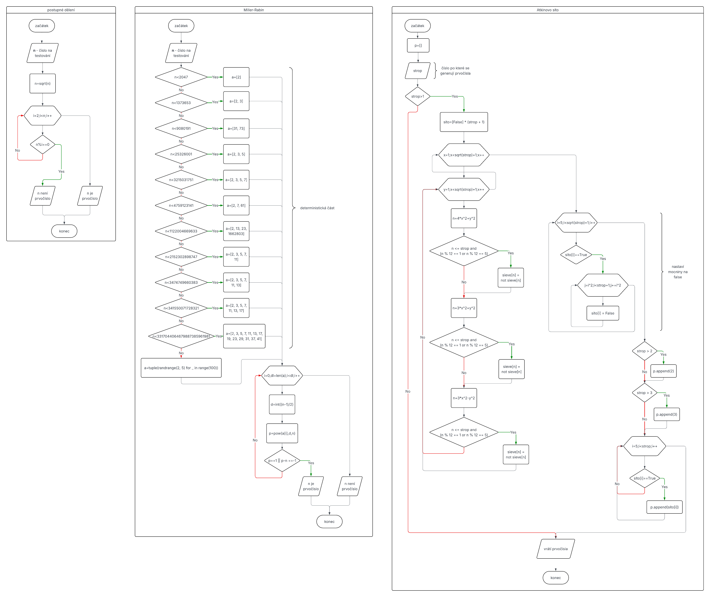
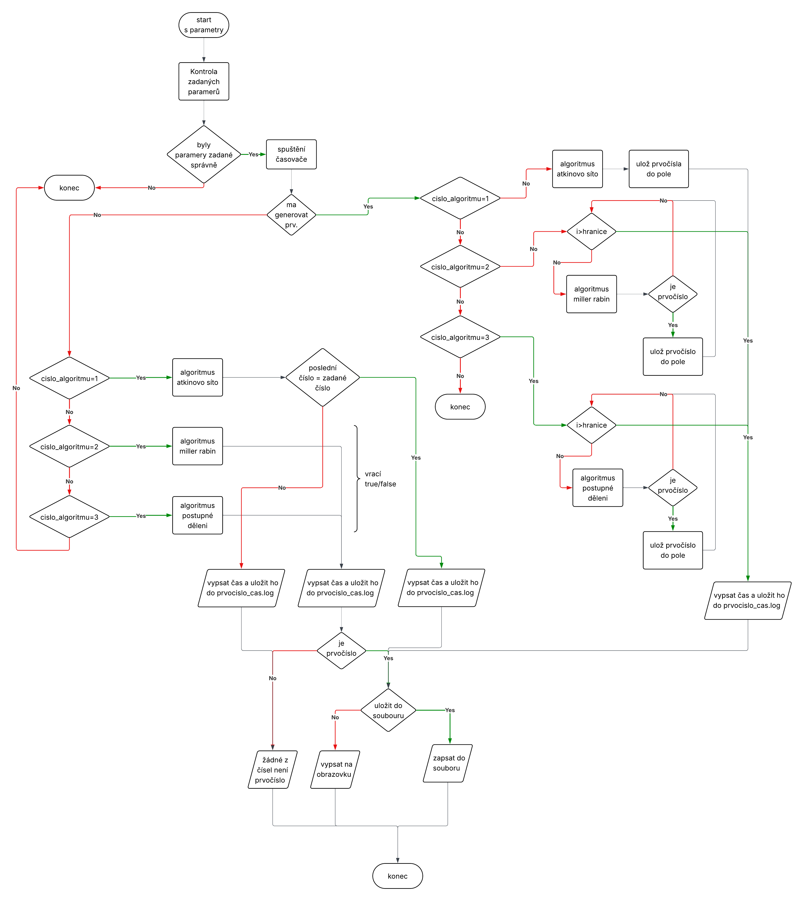

# gop.py

Python skript pro generování a ověřování prvočísel pomocí tří různých algoritmů:
- Atkinovo síto
- Miller-Rabinův test
- Postupné dělení

---

## Instalace

Není potřeba instalovat žádné externí knihovny.  
Používá pouze standardní Python moduly (`math`, `sys`, `time`, `random`).

---

## Použití

```bash
python gop.py [číslo_algoritmu] [čísla | -n="soubor"] [-g] [-u] [--help]
```

### Parametry

| Parametr          | Popis                                                   |
|--------------------|---------------------------------------------------------|
| `číslo_algoritmu` | 1 = Atkinovo síto, 2 = Miller-Rabin, 3 = Postupné dělení |
| `čísla`           | Čísla oddělená mezerami, např. `1000 2000`              |
| `-n="soubor"`     | Načte čísla ze souboru                                  |
| `-g`             | Generuje prvočísla až do dané hodnoty                   |
| `-u`             | Uloží výsledek do souboru                               |
| `--help`         | Zobrazí nápovědu                                        |

---

## Příklady

- Generování prvočísel do 1000 pomocí Atkinova síta:
    ```bash
    python gop.py 1 1000 -g
    ```

- Ověřování čísel ze souboru pomocí Miller-Rabin:
    ```bash
    python gop.py 2 -n="cisla.txt"
    ```

- Ověření čísla 9973 a uložení výsledku:
    ```bash
    python gop.py 3 9973 -u
    ```

---

## Výstupy

- **Obrazovka / Soubor**
    - Seznam prvočísel (`ulozena_prvocisla.txt`)

- **udalosti.log**
    - Průběh programu s časovými razítky

- **prvocisla_cas.log**
    - Čas generování/ověřování, největší prvočíslo, použitý algoritmus

---

## Algoritmy

- **Atkinovo síto** → efektivní generátor prvočísel do daného limitu.
- **Miller-Rabin** → rychlý pravděpodobnostní (deterministicky nastavený) test prvočíselnosti.
- **Postupné dělení** → jednoduchý test založený na dělení.

---

## Logování a měření času

Program zapisuje:
- průběh do `udalosti.log`
- čas výpočtu a největší prvočíslo do `prvocisla_cas.log`

---

## Hlavní funkce

- **zapis_debug(text)**  
  Zapíše zprávu do souboru `udalosti.log` s časovým razítkem.

- **help()**  
  Vytiskne nápovědu a ukončí program.

- **nacteni_cisel_soubor(cesta)**  
  Načte čísla ze souboru a vrátí seznam int.

- **ulozeni_prvocisel_soubor(prvocisla, cesta)**  
  Uloží seznam prvočísel do souboru.

- **atkinovoSito(strop)**  
  Vrátí seznam prvočísel do `strop` pomocí Atkinova síta.

- **millerRabin(n)**  
  Deterministický Miller-Rabinův test pro prvočíselnost.

- **postupneDeleni(n)**  
  Test prvočíselnosti pomocí dělení od 2 do √n.

---

## Diagramy

### Diagram algoritmů


### Diagram fungování kódu


---

## Průběh programu

1. Zpracuje argumenty z příkazové řádky.
2. Určí, zda generovat prvočísla, nebo ověřovat zadaná.
3. Spustí příslušný algoritmus:
    - generování: hledá všechna prvočísla do dané hodnoty
    - ověřování: kontroluje, zda zadaná čísla jsou prvočísla
4. Měří čas výpočtu.
5. Výsledek vypíše na obrazovku nebo uloží do souboru.
6. Zapíše záznam do logu a do `prvocisla_cas.log`.

---

